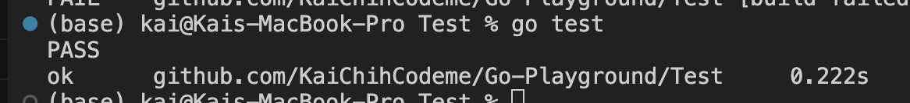

# TEST

## How to identify as testing file?
* Create a `_test.go` file which is the postfix of the file you want to test
* In the `_test.go` file, define a function prefix from `Test`.


## How to manual run the unit test?
Go to the folder:
```
go test
```



## Test Code
```
func Test(t *testing.T){
    t.Fatal() // Error and stop testing immediately

    t.Error() // Only present error, would not stop
}
```